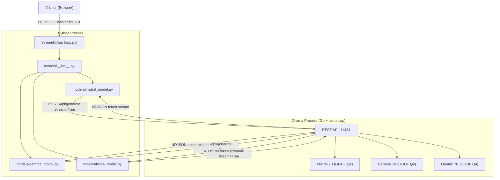

# Building a Prompt Engineering Playground: A Deep-Dive Into LLMs, Decoding, and the Local AI Revolution

*Written from the perspective of a senior AI/LLM researcher and software engineer — March 2026*

---

## Preface

This article is a complete technical and conceptual walkthrough of the [Prompt Engineering Playground](https://github.com/ArvindPadala/prompt-playground) — a local, open-source web application that lets you experiment with prompts and decoding parameters across three frontier language models: **Mistral**, **Gemma**, and **Llama2**, all running on your own hardware via Ollama.

But this isn't just a project walkthrough. Every concept the project touches — from how transformers generate tokens to why temperature matters and why running LLMs locally has become a strategic imperative in 2026 — is explained from first principles, grounded in the latest research, and illustrated with concrete examples. By the end of this article, you'll understand the project, understand the field it sits in, and understand why these ideas matter more than ever.

---

## Table of Contents

1. [What Problem Does This Project Solve?](#1-what-problem-does-this-project-solve)
2. [How LLMs Actually Work: From Tokens to Text](#2-how-llms-actually-work-from-tokens-to-text)
3. [Autoregressive Generation: The Token-by-Token Truth](#3-autoregressive-generation-the-token-by-token-truth)
4. [Decoding Strategies: Temperature, Top-k, and Top-p](#4-decoding-strategies-temperature-top-k-and-top-p)
5. [Prompt Engineering: The Art and Science](#5-prompt-engineering-the-art-and-science)
6. [System Prompts: Shaping Model Persona and Behaviour](#6-system-prompts-shaping-model-persona-and-behaviour)
7. [The Three Models: Mistral, Gemma, Llama2](#7-the-three-models-mistral-gemma-llama2)
8. [Ollama: The Local LLM Runtime Powering It All](#8-ollama-the-local-llm-runtime-powering-it-all)
9. [Streaming: Why Tokens Appear One by One](#9-streaming-why-tokens-appear-one-by-one)
10. [Concurrency: Running Three Models in Parallel](#10-concurrency-running-three-models-in-parallel)
11. [Token Statistics: What the Numbers Mean](#11-token-statistics-what-the-numbers-mean)
12. [Streamlit: Democratising AI Apps](#12-streamlit-democratising-ai-apps)
13. [Architecture Deep Dive: The Full System](#13-architecture-deep-dive-the-full-system)
14. [Today's Relevance: Why Every Concept Here Matters in 2026](#14-todays-relevance-why-every-concept-here-matters-in-2026)
15. [Conclusion](#15-conclusion)

---

## 1. What Problem Does This Project Solve?

When you use ChatGPT, Claude, or Gemini, you interact with LLMs through polished interfaces that hide enormous complexity. You type a message, you get a reply. But two critical things are invisible: **which model answered** and **how the model was configured**.

This invisibility is costly. Developers, researchers, and practitioners who deploy LLMs professionally need to understand:

- How does phrasing the same question differently change the answer? *(prompt sensitivity)*
- What does turning up the "temperature" from 0.3 to 1.2 actually do to the quality of a response?
- Does Mistral handle reasoning tasks differently to Gemma on identical inputs?
- At what point does creative freedom become incoherence?

The Prompt Engineering Playground answers all of these questions by giving you a **live laboratory**: a web UI where you can adjust every variable and watch the effects in real time, with three different models, side by side.

Think of it as the difference between reading about how a combustion engine works versus being handed a transparent-hood car where you can adjust the fuel mixture while the engine runs.

---

## 2. How LLMs Actually Work: From Tokens to Text

### What is a Token?

Before understanding what the playground controls, you need to understand what LLMs operate on. They do not operate on letters, words, or sentences. They operate on **tokens** — a sub-word encoding of text.

Common tokenisation is done via **Byte-Pair Encoding (BPE)**, introduced in *Neural Machine Translation of Rare Words with Subword Units* (Sennrich et al., 2016). The intuition: start with individual characters, then iteratively merge the most frequent adjacent pair until you reach your target vocabulary size (typically 32,000–128,000 tokens).

**Example with Mistral's tokeniser:**

| Text | Tokens |
|---|---|
| `"Hello"` | `["Hello"]` — 1 token |
| `"unhappiness"` | `["un", "happiness"]` — 2 tokens |
| `"Tell me a joke about data scientists"` | `["Tell", " me", " a", " joke", " about", " data", " scientists"]` — 7 tokens |
| `"ChatGPT"` | `["Chat", "G", "PT"]` — 3 tokens |

This matters for our project because:
1. The **token count** determines how much computation the model does (longer prompts = more compute)
2. The token stats panel in the playground shows you `Prompt Tokens` and `Output Tokens` — now you know exactly what that means

### The Transformer Architecture

Every model in this playground — Mistral, Gemma, Llama2 — is a **decoder-only Transformer**, the architecture introduced in *Attention Is All You Need* (Vaswani et al., 2017).

The key mechanism is **self-attention**: every token in the sequence attends to every other token (weighted by learned relevance), allowing the model to capture long-range dependencies that previous architectures (RNNs, LSTMs) struggled with.

A transformer processes your prompt through:

```
Input Tokens → Token Embeddings → [N × Transformer Blocks] → Logits over Vocabulary
```

Each transformer block contains:
1. **Multi-Head Self-Attention** — lets each token "look at" all previous tokens
2. **Feed-Forward Network** — applies learned transformations
3. **Layer Normalisation** — stabilises training

The output is a vector of raw scores (**logits**) over the entire vocabulary. A logit is just an unnormalised log-probability. Converting logits to a probability distribution is where **decoding strategies** come in.

---

## 3. Autoregressive Generation: The Token-by-Token Truth

Here is the most important thing most people don't realise about LLMs: **they generate one token at a time, in a loop.**

```
Step 1: Input = "Tell me a joke about"
        → Model outputs: P(next token) over vocabulary
        → Selected token: " data"

Step 2: Input = "Tell me a joke about data"
        → Model outputs: P(next token) | conditioning on full history
        → Selected token: " scientists"

Step 3: Input = "Tell me a joke about data scientists"
        → ... and so on until <end-of-sequence> token
```

This is called **autoregressive decoding**. Each token generated becomes part of the input for the next step. The model never "backtracks" — it can't revise `" data"` once it has been selected. This explains:

- Why outputs sometimes go wrong "mid-sentence" and compound the error
- Why streaming (showing tokens as they appear) reflects the actual computation order
- Why **sampling strategy** — how you pick the next token from the probability distribution — matters so much

The playground's real-time streaming display makes this process visible. You're watching the model think, token by token.

---

## 4. Decoding Strategies: Temperature, Top-k, and Top-p

At every generation step, the model produces a logit vector of size `V` (vocabulary size, e.g. 32,000). After softmax, this becomes a probability distribution. The question is: **which token do you pick?**

Three strategies — which map directly to the three sliders in the playground's sidebar — govern this decision.

### 4.1 Temperature

**Mathematical definition:**

Given logits `z₁, z₂, …, z_V` and temperature `T`:

```
P(token i) = exp(zᵢ / T) / Σⱼ exp(zⱼ / T)
```

Temperature is a divisor applied to logits **before** the softmax. Notice:
- `T → 0`: division makes high logits enormous and low logits negligible → near-deterministic "greedy" decoding → always picks the highest-probability token
- `T = 1.0`: no scaling → raw model distribution → the "true" model view
- `T > 1.0`: flattens the distribution → more tokens become plausible → more randomness, more creativity, higher risk of incoherence

**Intuitive example:**

Say the model assigns logits: `[rocket=10, cat=3, banana=1]`

| Temperature | P(rocket) | P(cat) | P(banana) |
|---|---|---|---|
| 0.1 | ~100% | ~0% | ~0% |
| 0.7 | ~93% | ~7% | ~0% |
| 1.0 | ~80% | ~18% | ~2% |
| 1.5 | ~60% | ~30% | ~10% |

**2025 Research Finding:** A landmark EMNLP 2024 paper found that *changes in sampling temperature between 0.0 and 1.0 do not have a statistically significant impact on LLM performance for problem-solving tasks* — suggesting the model's training distribution has more influence than temperature on accuracy. However, beyond 1.5, quality degrades measurably as format inconsistencies emerge (GPT-4o studies, ResearchGate 2025).

**Practical guidance for playground use:**
- `0.1–0.3`: factual Q&A, code generation, structured outputs
- `0.6–0.9`: balanced creative writing, summaries
- `1.0–1.4`: brainstorming, poetry, role-play
- `>1.4`: experimental — watch for repetition and incoherence

### 4.2 Top-k Sampling

After the softmax distribution is computed, **Top-k sampling** truncates it: keep only the `k` highest-probability tokens, re-normalise, then sample from that reduced set.

```python
# Pseudocode
probs = softmax(logits)
top_k_probs, top_k_indices = torch.topk(probs, k=50)
top_k_probs = top_k_probs / top_k_probs.sum()  # re-normalise
next_token = sample(top_k_indices, weights=top_k_probs)
```

**Why this matters:** Without restriction, the model might occasionally sample from very low-probability tokens (the "tail" of the distribution), producing non-sequiturs. Top-k prevents this by eliminating the unreliable tail.

**The problem with fixed k:** When the model is highly confident (peaked distribution), `k=50` still forces consideration of 49 low-probability tokens. When the model is genuinely uncertain (flat distribution), `k=50` might discard valid options. The size of the plausible set varies context by context.

**2024 Research:** A formal theoretical framework for Top-k decoding (NeurIPS opt-ml workshop, 2024) confirmed its effectiveness at improving LLM performance by truncating unreliable tails, but also highlighted the fixed-`k` limitation as a motivation for newer methods.

**Playground setting:** `k=0` disables top-k entirely (passes all tokens to subsequent sampling). `k=50` is the conventional default.

### 4.3 Top-p (Nucleus) Sampling

Introduced in *The Curious Case of Neural Text Degeneration* (Holtzman et al., 2020), nucleus sampling addresses the fixed-k problem dynamically.

**Algorithm:**
1. Sort tokens by probability descending
2. Take the minimum prefix of tokens whose **cumulative probability ≥ p**
3. Sample from this "nucleus"

```
Vocabulary (sorted): rocket(0.80), cat(0.15), banana(0.03), chair(0.01), ...
Cumulative:          0.80,         0.95,       0.98,          0.99, ...

With p=0.90: nucleus = {rocket, cat}   (cumsum first hits 0.90 at cat)
With p=0.99: nucleus = {rocket, cat, banana, chair, ...}
```

The nucleus shrinks when the model is confident and expands when uncertain — dynamically adapting to the model's epistemic state.

**Current Recommendation (2026):** For commercial APIs, `temperature` with `top_p=0.9–0.95` remains standard best practice. However, an emerging alternative called **Min-P sampling** (accepted NeurIPS 2025; ArXiv 2025) is gaining traction in open-source deployments. Min-P scales the sampling threshold relative to the top token's probability, providing better balance between quality and creativity at high temperatures. This is an active research frontier.

**Interaction effects in the playground:** You can use top-k and top-p together — the effective candidate set is the intersection of both constraints. Or you can set one to its "off" value (`k=0`, `p=1.0`) and work with just one.

---

## 5. Prompt Engineering: The Art and Science

### What Is Prompt Engineering?

A **prompt** is the input text you give to the model. Prompt engineering is the practice of crafting inputs that reliably produce high-quality outputs. It sits at the intersection of linguistics, psychology, and ML systems knowledge.

The challenge: LLMs are not databases that return deterministic results. They are statistical predictors of plausible continuations. The same information, phrased differently, can produce radically different outputs.

**Example — same question, three formulations:**

```
Prompt A: "What is gradient descent?"
→ Likely output: A textbook definition

Prompt B: "Explain gradient descent to a 12-year-old using a mountain hiking analogy"
→ Likely output: A vivid, accessible metaphor-driven explanation

Prompt C: "You are a frustrated senior ML engineer reviewing a junior's code. 
           The junior doesn't understand gradient descent. 
           Explain it to them in your characteristically blunt style."
→ Likely output: A pointed, personality-rich explanation with industry context
```

Same underlying knowledge, radically different outputs — from changing the framing, not the facts requested.

### Core Prompt Engineering Techniques

**1. Zero-Shot Prompting**
No examples given. Relies entirely on the model's pre-training knowledge.
```
Prompt: "Classify the sentiment of this review: 'The food was cold and disappointing.'"
```

**2. Few-Shot Prompting**
Provide examples of the desired input-output pattern.
```
Prompt: "Classify sentiment.
Review: 'Best meal ever!' → Positive
Review: 'Disgusting experience.' → Negative
Review: 'The food was cold and disappointing.' →"
```
Few-shot prompting was formalised by *Brown et al., GPT-3 paper (2020)* and shown to dramatically improve performance without any parameter updates.

**3. Chain-of-Thought (CoT) Prompting**
Adding "Let's think step by step" or providing reasoning chains before the answer.
```
Prompt: "If I have 5 apples and give 2 to Alice and 1 to Bob, how many do I have? 
         Let's think step by step."
```
*Wei et al. (2022)* showed CoT reduces errors on arithmetic and reasoning tasks by 40–80% on benchmark datasets. This technique is now baked into the system prompts of most commercial assistants.

**4. Role/Persona Prompting**
The system prompt field in the playground directly enables this:
```
System: "You are a battle-hardened options trader who explains financial concepts 
         using war metaphors."
User: "Explain implied volatility."
```

### Today's Standing (2026)

Prompt engineering has evolved from artisanal craft to systematic discipline. Key markers of this maturation:

- **Gartner forecast (2024):** 70% of enterprises will deploy AI-driven *automated* prompt optimisation by 2026 — systems that improve their own prompts
- **Structured prompt processes have been shown to reduce AI errors by up to 76%** (SQ Magazine, 2025 industry study)
- **"Context Engineering"** has emerged as a broader umbrella term, with Retrieval-Augmented Generation (RAG) dominating in 2025 for dynamically assembling context
- The role of "prompt engineer" is evolving into **"AI Behaviour Architect"** — a more technical position that designs entire AI systems, not just single prompts

The playground gives you a manual laboratory for developing the exact intuitions that underpin these automated systems.

---

## 6. System Prompts: Shaping Model Persona and Behaviour

### What Is a System Prompt?

The system prompt (also called an instruction prompt or system message) is a special input that runs **before** the user's message, invisible to the user in most deployments. It establishes:
- Persona and voice
- Response format constraints
- Knowledge scope restrictions
- Behavioural guardrails

In the Ollama API (and all major LLM APIs), it's passed as a separate field:
```json
{
  "model": "mistral",
  "system": "You are a concise technical writer. Always use bullet points. Never exceed 200 words.",
  "prompt": "Explain how neural networks learn"
}
```

### Why System Prompts Are Powerful

They leverage the model's instruction-following capabilities trained via **RLHF** (Reinforcement Learning from Human Feedback) and **RLAIF** (Reinforcement Learning from AI Feedback). During fine-tuning, models were shown millions of examples of (system_prompt, user_prompt) → response pairs rated by quality. The model learned to treat the system message as an authoritative constraint.

**Real-world example — same user prompt, different system prompts:**

| System Prompt | User: "How do I quit my job?" | Response Flavour |
|---|---|---|
| *(none)* | How do I quit my job? | Generic professional advice |
| "You are a blunt Wall Street trader" | " | "Draft an email, keep it short, don't burn bridges — unless they deserve it." |
| "You are a 16th-century samurai philosopher" | " | "One does not simply abandon one's lord. Honour demands a formal departure..." |
| "Respond only in haiku" | " | "Leave words on the desk / Bow once, then walk toward the door / Cherry blossoms fall" |

The system prompt is what companies like OpenAI use to turn raw GPT-4 into specialised products — legal assistants, coding copilots, customer service bots — without retraining the model.

The playground's `🛠️ System Prompt` expander lets you experiment with exactly this, in real time, across three different model architectures.

---

## 7. The Three Models: Mistral, Gemma, Llama2

### 7.1 Mistral 7B

**Released:** September 2023, by Mistral AI (Paris)  
**Architecture:** Decoder-only transformer with two innovations:
- **Grouped Query Attention (GQA):** Reduces KV-cache memory by using fewer key-value heads than query heads, enabling faster inference
- **Sliding Window Attention (SWA):** Each token attends to a window of previous tokens rather than all of them, reducing quadratic attention cost

**What makes it remarkable:**
At 7 billion parameters, Mistral 7B *outperformed Llama 2 13B on every evaluated benchmark* at release — including reasoning, math, and code tasks. It punches far above its parameter count, largely due to architectural efficiency and high-quality training data curation.

**Benchmark highlights (at release, 2023):**
- MMLU (academic knowledge): 60.1% — beats Llama 2 13B (54.8%)
- HumanEval (code): 26.2% — beats Llama 2 13B (18.3%)
- Math (GSM8K): 52.2% — beats Llama 2 13B (28.9%)

**Current standing (2026):**
Mistral AI has since released Mistral Large, Mistral 8x7B (a Mixture-of-Experts model matching GPT-3.5 with 6× faster inference), and Codestral (86.6% HumanEval). Mistral 3 is anticipated with the 14B variant predicted to surpass Gemma 3 12B on key reasoning metrics (DataCamp projections, 2026).

### 7.2 Gemma (Google DeepMind)

**Released:** February 2024, by Google DeepMind  
**Architecture:** Built on the same research foundation as **Gemini**, Gemma uses:
- Multi-head attention (not grouped)
- GeGLU activation functions
- RoPE (Rotary Position Embedding)
- No bias terms in linear layers (efficiency)

**What makes it remarkable:**
Gemma is the first open model released by Google with genuine research pedigree. The "Gemma" name signals it's distilled from the same infrastructure that built Gemini. It was released with extensive safety evaluations, responsible AI documentation, and a permissive license for commercial use.

**Current standing (2026):**
Gemma 3 is multimodal, supporting text + images, features a **128K context window**, and covers 140+ languages in sizes from 2B to 27B parameters (Google AI Blog, 2025). Gemma 3 270M shows strong instruction-following capabilities even at extremely small scale. The trajectory from Gemma (2B, 7B) in 2024 to Gemma 3's massive context window represents Google's seriousness about open models.

### 7.3 Llama 2 (Meta AI)

**Released:** July 2023, by Meta AI  
**Architecture:** Standard transformer with:
- **RoPE** positional embeddings
- **SwiGLU** activation functions
- **GQA** on the larger variants (34B, 70B)

**What makes it remarkable:**
Llama 2's significance is largely political and cultural: Meta open-sourced a **truly commercially usable** model family with a permissive license. This was watershed. Before Llama 2, the open-source ecosystem had model weights but restricted commercial use. Llama 2 launched an ecosystem.

Llama 2 70B performs near GPT-3.5 on MMLU and matched it in human helpfulness evaluations. It achieved near-human accuracy in fact-checking tasks, comparable to GPT-4 on some dimensions (Meta research report, 2023).

**Current standing (2026):**
The Llama lineage has dramatically advanced. **Llama 3 70B** (April 2024) significantly outperforms Mistral 7B and Gemma 2 9B across MMLU, GPQA, GSM-8K, MATH, and HumanEval. **Llama 4 Scout** is anticipated to offer a 10 million token context window by 2026 — enough to fit the entire codebase of a large enterprise application in a single context. Llama 2, which this playground uses, is the historical baseline that started this trajectory.

---

## 8. Ollama: The Local LLM Runtime Powering It All

### What Is Ollama?

Ollama is an open-source runtime for running large language models locally. It handles:
- Model download, storage, and version management
- GPU/CPU resource allocation and offloading
- HTTP API serving (OpenAI-compatible API)
- Multiple simultaneous model sessions

From the user's perspective, it's as simple as:
```bash
ollama pull mistral
ollama run mistral
# → Interactive chat in your terminal
```

Or, for applications (like this playground), it exposes a REST API at `http://localhost:11434`.

### How Ollama Works Under the Hood

Ollama uses **llama.cpp** as its core inference engine — a C++ implementation of transformer inference optimised for CPU and Apple Silicon (Metal GPU), with CUDA support for NVIDIA GPUs.

Models are stored as **GGUF** files (GPT-Generated Unified Format), a binary format that supports:
- **Quantisation** — reducing float32 weights to int4 or int8, dramatically shrinking model size and memory requirements without catastrophic quality loss
- Cross-platform compatibility
- Metadata embedding (tokeniser config, architecture params)

Your system runs Mistral 7B on Apple M-series with 16GB RAM. The model is quantised to 4-bit, bringing its effective size from ~14GB (full precision) to ~4.1GB. The Metal GPU handles tensor operations with near-GPU speed.

### The API We Use

The playground calls:
```
POST http://localhost:11434/api/generate
```

With the payload:
```json
{
  "model": "mistral",
  "prompt": "Tell me a joke about data scientists",
  "system": "Be concise and witty",
  "stream": true,
  "options": {
    "temperature": 0.7,
    "top_p": 1.0,
    "top_k": 50
  }
}
```

Ollama responds with a stream of **newline-delimited JSON** (NDJSON) objects, one per token.

### Today's Standing (2026)

Ollama has become the **de facto standard for local LLM deployment**:
- By 2026, it is described as "the default choice for local LLMs, removing much of the complexity previously associated with model formats and runtime backends" (dev.to analysis, 2026)
- Native desktop apps released for macOS and Windows in 2025, with GUI chat interface
- Global usage concentrated in US and China, with deployments on AWS, Alibaba Cloud, and Tencent Cloud — showing it's not just a "local only" tool
- Multimodal support added in 2025 (vision-language models runnable locally)
- "Thinking mode" (chain-of-thought) and streaming tool responses added to developer API

**Why this matters:** The ability to run frontier-quality models locally has profound implications for privacy, cost, and democratisation:
- **Healthcare:** Hospitals can run medical-domain LLMs on patient data without sending it to external servers
- **Legal & Finance:** Firms can use AI on confidential documents without cloud exposure
- **Offline & Edge:** LLMs deployable on laptops without internet connectivity
- **Cost:** Zero per-token costs vs. $0.01–0.06 per 1K tokens for commercial APIs

---

## 9. Streaming: Why Tokens Appear One by One

### The Problem With Waiting

As we established, LLMs generate one token at a time. A 200-word response might take 10–40 seconds to generate on a local machine. Without streaming, the user stares at a blank screen for the entire duration, then sees everything at once. This is:
- **Poor UX** — users don't know if the model is running or crashed
- **Not reflective of reality** — the model is actually producing tokens throughout

### NDJSON Streaming

Ollama's streaming API response is a sequence of **Newline-Delimited JSON** (NDJSON) objects:

```
{"model":"mistral","response":"Why","done":false}
{"model":"mistral","response":" did","done":false}
{"model":"mistral","response":" the","done":false}
...
{"model":"mistral","response":" data","done":false}
{"model":"mistral","response":" scientist","done":false}
{"model":"mistral","response":" break","done":false}
{"model":"mistral","response":" up","done":false}
...
{"model":"mistral","response":"","done":true,"prompt_eval_count":9,"eval_count":47,"eval_duration":3200000000}
```

The final object with `"done": true` carries the token statistics.

### How the Playground Handles It

The model files implement this as Python generators:

```python
def call_mistral(prompt, ...):
    response = requests.post(url, json=payload, stream=True, timeout=120)
    response.raise_for_status()
    for line in response.iter_lines():
        if line:
            data = json.loads(line.decode("utf-8"))
            token = data.get("response", "")
            if data.get("done", False):
                stats = {
                    "prompt_tokens": data.get("prompt_eval_count", 0),
                    "output_tokens": data.get("eval_count", 0),
                    "duration_ns": data.get("eval_duration", 0),
                }
                yield token, stats
            else:
                yield token, None
```

In single-model mode, Streamlit's `st.write_stream()` receives this generator and renders each token incrementally — the typewriter effect you see in the UI.

```python
st.write_stream(stream_and_capture())
```

This is a zero-latency-to-first-token experience: the user sees output virtually immediately, even if the full response takes 30 seconds.

---

## 10. Concurrency: Running Three Models in Parallel

### The Challenge

When you select all three models and click Generate, three separate Ollama API calls must be made. If done sequentially:
- Mistral generates in 15 seconds
- Then Gemma generates in 20 seconds
- Then Llama2 generates in 18 seconds
- **Total wait: 53 seconds**

Done in parallel:
- All three generate simultaneously
- **Total wait: ~20 seconds** (the slowest individual model)

### Python's ThreadPoolExecutor

The playground uses `concurrent.futures.ThreadPoolExecutor`:

```python
with concurrent.futures.ThreadPoolExecutor(max_workers=len(selected_models)) as executor:
    futures = {
        executor.submit(
            run_model_blocking,
            name, user_prompt, system_prompt,
            temperature, top_p, top_k, ollama_url,
        ): name
        for name in selected_models
    }
    results = {}
    for future in concurrent.futures.as_completed(futures):
        name, text, stats = future.result()
        results[name] = (text, stats)
```

**Why threads (not asyncio or multiprocessing)?**

- The workload is **I/O-bound** (waiting for HTTP responses from Ollama), not CPU-bound. Python's GIL (Global Interpreter Lock) doesn't block I/O threads from running simultaneously.
- `asyncio` would also work but requires the entire call stack to be async-aware, adding complexity
- `multiprocessing` would be overkill — we're not doing parallel computation, we're parallel-waiting

The model runs in Ollama's process (a compiled Go/C++ application), not in Python. Python threads merely manage the waiting and response assembly. This is exactly the right tool for the job.

---

## 11. Token Statistics: What the Numbers Mean

The playground displays three metrics after each generation:

### Prompt Tokens
The number of tokens in your **input** (system prompt + user prompt). Important because:
- Directly impacts inference time (attention is quadratic in sequence length)
- Affects cost in commercial APIs
- Reveals tokenisation efficiency — "tokenize" is 3 tokens; "cat" is 1

### Output Tokens
The number of tokens **generated** by the model. Combined with generation time:
- Defines the work the model did
- Lets you compare models' verbosity on identical tasks

### Tokens per Second
```
tokens/sec = output_tokens / (eval_duration_nanoseconds / 1e9)
```

This is your hardware performance metric. On Apple M-series with Mistral 7B quantised to 4-bit:
- 8–15 tokens/sec is typical
- Each token corresponds roughly to 0.75 words
- 10 tokens/sec ≈ 450 words/minute — faster than most humans can read

This metric is also a proxy for **reasoning quality**: models that spend more compute per token (lower tokens/sec) often produce more careful, structured responses.

---

## 12. Streamlit: Democratising AI Apps

Streamlit is a Python framework that converts Python scripts into interactive web applications with zero frontend code.

**What makes it powerful for AI applications:**
- `st.write_stream()` natively handles Python generators — perfect for LLM streaming
- `st.session_state` provides persistent state across user interactions (prompt history)
- `st.columns()` and `st.expander()` compose rich layouts
- Hot-reloading: save [app.py](file:///Users/arvindpadala/Projects/prompt-playground/app.py), the browser updates instantly

The playground pushes Streamlit's capabilities:
- Custom CSS injection via `st.markdown(unsafe_allow_html=True)` for premium styling
- Session state for prompt history and URL restoration
- Concurrent futures for parallel model execution
- Generator-based streaming for real-time token display

**Today's Standing (2026):**
Streamlit has become the standard for ML demos and internal AI tools. Hugging Face Spaces runs hundreds of thousands of Streamlit apps. The pattern of "Python file → deployable web app" has been enormously productive for the research community, allowing models to be demonstrated and tested without frontend engineers.

---

## 13. Architecture Deep Dive: The Full System



**Data Flow (single model, streaming):**
1. User types prompt, clicks Generate
2. Streamlit calls [call_mistral()](file:///Users/arvindpadala/Projects/prompt-playground/models/mistral_model.py#5-51) generator
3. [call_mistral()](file:///Users/arvindpadala/Projects/prompt-playground/models/mistral_model.py#5-51) opens HTTP POST to Ollama with `stream=True`
4. Ollama loads model weights into Metal GPU (if not already cached), begins autoregressive inference
5. Each generated token → NDJSON line → `iter_lines()` yields it → generator yields to `st.write_stream()`
6. Streamlit renders token incrementally in the browser via WebSocket
7. Final NDJSON object carries token stats → rendered as metric cards

**Data Flow (multiple models, parallel):**
Steps 2–6 run simultaneously in 3 threads via `ThreadPoolExecutor`. Ollama handles concurrent model requests, using available VRAM/RAM to serve multiple models (or time-slicing if insufficient resources). Results are collected synchronously after all threads complete.

---

## 14. Today's Relevance: Why Every Concept Here Matters in 2026

### The Local AI Revolution Is Here

In 2022, running a frontier-quality LLM required renting GPU cluster time. In 2026, Arvind Padala runs Mistral 7B, Gemma 7B, and Llama2 7B **simultaneously** on a 16GB MacBook at home. This is not incremental progress — it is a phase transition.

The enablers: aggressive model quantisation (4-bit GGUF), Apple's unified memory architecture, Ollama's inference optimisation, and community-driven open-source model releases.

**Why this matters beyond convenience:**
- The McKinsey Global Institute (2024) estimated AI could add $2.6–4.4 trillion annually to the global economy. A meaningful fraction of that is unlocked when AI can be deployed privately, at zero marginal cost, in regulated industries
- Healthcare, legal, and defence sectors — where data sovereignty is non-negotiable — can now access LLM capabilities without cloud exposure
- Individuals in countries with strict data localisation laws can build AI products that were previously impossible

### Prompt Engineering Is Infrastructure

In 2026, "prompt engineering" sounds as mundane as "database query writing" — because it is exactly that level of foundational. Every AI-powered product has prompts. Every agent has a system prompt. Every RAG pipeline has a retrieval prompt and a synthesis prompt.

The structured understanding you build by using this playground — watching how temperature inflates creativity and erodes precision, how system prompts anchor model persona, how Mistral and Gemma respond differently to identical inputs — is the foundational knowledge that separates AI practitioners who build reliable systems from those who build fragile ones.

**Proof:** Anthropic's published research (2024) on Constitutional AI and Google's research on instruction following both emphasise that the quality of system prompts is the primary determinant of model behaviour in deployed systems — more than model choice or fine-tuning, in many cases.

### The Decoding Strategy Renaissance

The three parameters in this playground's sidebar are not static knowledge. They are an active research frontier:

- **Min-P sampling** (NeurIPS 2025, ArXiv) is proposing to replace top-k and top-p in open-source deployments
- **Top-n-sigma** (2025) addresses temperature coupling in probability-based truncation
- **Speculative decoding** (2024) dramatically accelerates inference by running a small "draft" model in parallel with a large "verifier" model
- **Inference-time scaling** (DeepSeek R1, OpenAI o1/o3 family, 2024–2025) has shown that spending more compute **at generation time** (chain-of-thought, repeated sampling, tree search) often outperforms simply training larger models

The playground is your hands-on entry point to understanding the space where all of this research plays out in practice.

### Model Competition and Open Source Power

The models in this playground were released in 2023–2024. By early 2026:
- **Llama 4 Scout**: 10M token context window (projected)
- **Gemma 3**: multimodal, 128K context, 140+ languages
- **Mistral Large**: outperforming models 10× its size on coding benchmarks

Open-source models are closing the gap with proprietary ones faster than almost anyone predicted. Llama 3 70B (April 2024) surpassed GPT-3.5 on multiple benchmarks just one year after Llama 2's release. The trajectory is clear.

The playground's architecture is **model-agnostic by design**: swapping Llama2 for Llama 3 is a one-line change in [models/llama_model.py](file:///Users/arvindpadala/Projects/prompt-playground/models/llama_model.py). The entire infrastructure generalises.

---

## 15. Conclusion

The Prompt Engineering Playground is small in lines of code (~440 lines across 6 files) but large in what it demonstrates. Let's enumerate:

| Layer | Technology | Concept Demonstrated |
|---|---|---|
| UI | Streamlit | Python-native web apps, session state, streaming |
| Concurrency | ThreadPoolExecutor | I/O-bound parallel execution |
| Streaming | NDJSON + requests | HTTP streaming, generator functions |
| LLM Inference | Ollama + llama.cpp | Local model serving, GGUF quantisation |
| Decoding | Temperature, Top-k, Top-p | Probabilistic sampling theory |
| Prompting | System + User prompts | Instruction following, persona design |
| Models | Mistral, Gemma, Llama2 | Transformer architectures, open-source LLMs |

The project is reproducible on any Mac with 8GB+ RAM, costs exactly zero dollars to run, requires no cloud account, and protects your data completely.

You now hold the conceptual tools to:
1. Understand *why* LLMs generate text the way they do
2. Control *how* that generation behaves through decoding parameters
3. Steer *what* the model produces through prompt engineering
4. Deploy *any* model locally through Ollama's growing ecosystem
5. Compare *multiple* model architectures scientifically, in parallel

The industry is moving toward agentic AI, multimodal models, and trillion-parameter architectures. But the foundations — autoregressive generation, sampling strategies, prompt design, local inference — remain constant. This playground is a laboratory for mastering those foundations.

> *"The best way to understand a complex system is to build a simple instrument that lets you vary one thing at a time and observe what changes. That is what this project is."*

---

## References and Further Reading

| Topic | Source |
|---|---|
| Attention mechanism | Vaswani et al., *Attention Is All You Need* (2017) |
| Byte-Pair Encoding | Sennrich et al. (2016) |
| GPT-3 / Few-Shot Learning | Brown et al. (2020) |
| Chain-of-Thought | Wei et al. (2022) |
| Top-p / Nucleus Sampling | Holtzman et al., *The Curious Case of Neural Text Degeneration* (2020) |
| Min-P Sampling | ArXiv 2025 / NeurIPS 2025 |
| Temperature & LLM performance | EMNLP 2024 (ACL Anthology) |
| Mistral 7B | Jiang et al., Mistral AI Technical Report (2023) |
| Llama 2 | Touvron et al., Meta AI (2023) |
| Gemma | Google DeepMind Technical Report (2024) |
| Ollama ecosystem (2026) | dev.to industry analysis, datasharepro.in (2026) |
| Prompt engineering trends | Gartner AI Predictions 2024; SQ Magazine 2025 |
| Local LLM revolution | SitePoint, XDA Developers on Ollama growth (2025–2026) |
